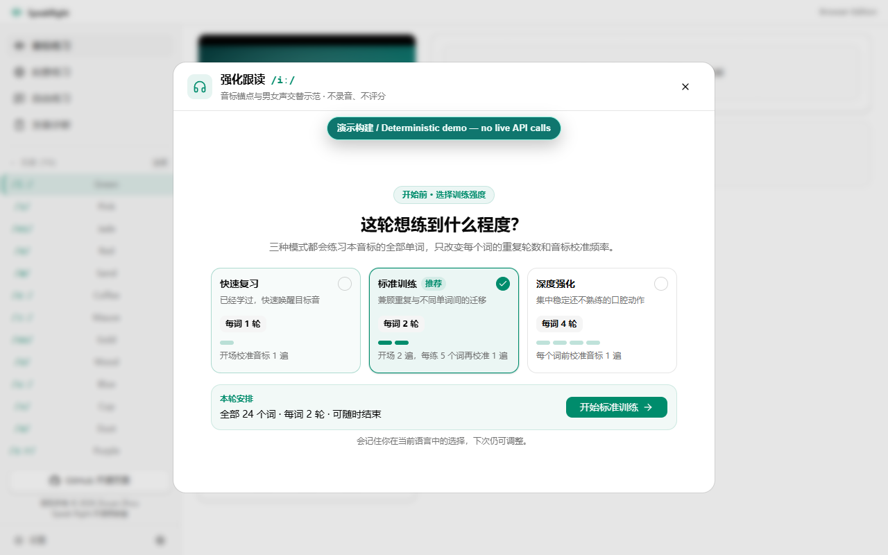
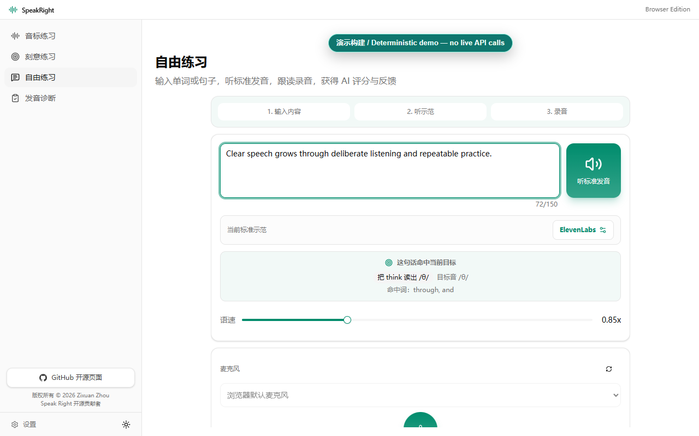
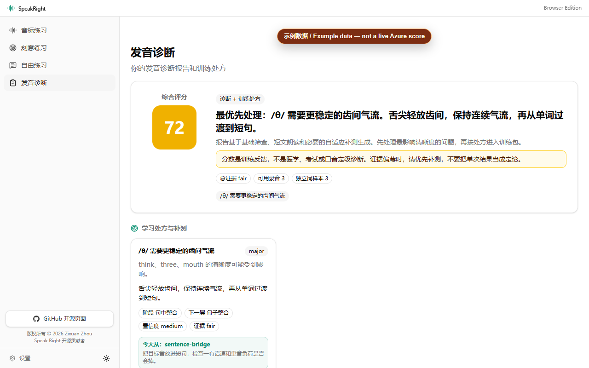
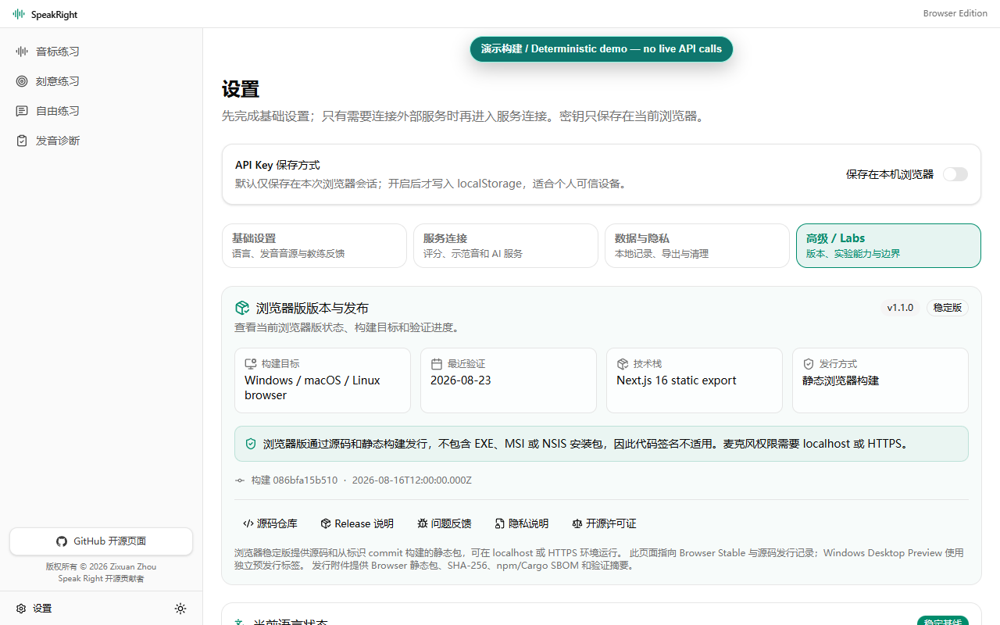
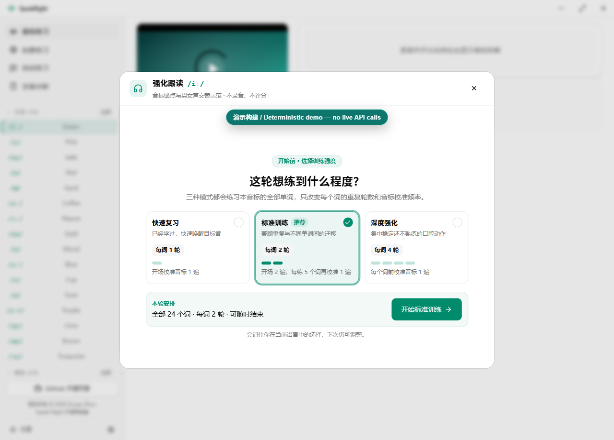
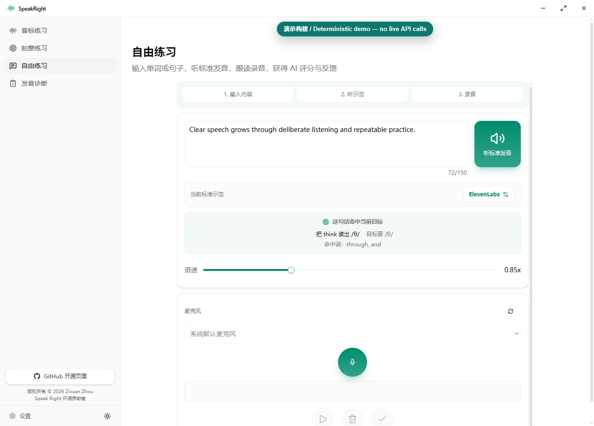
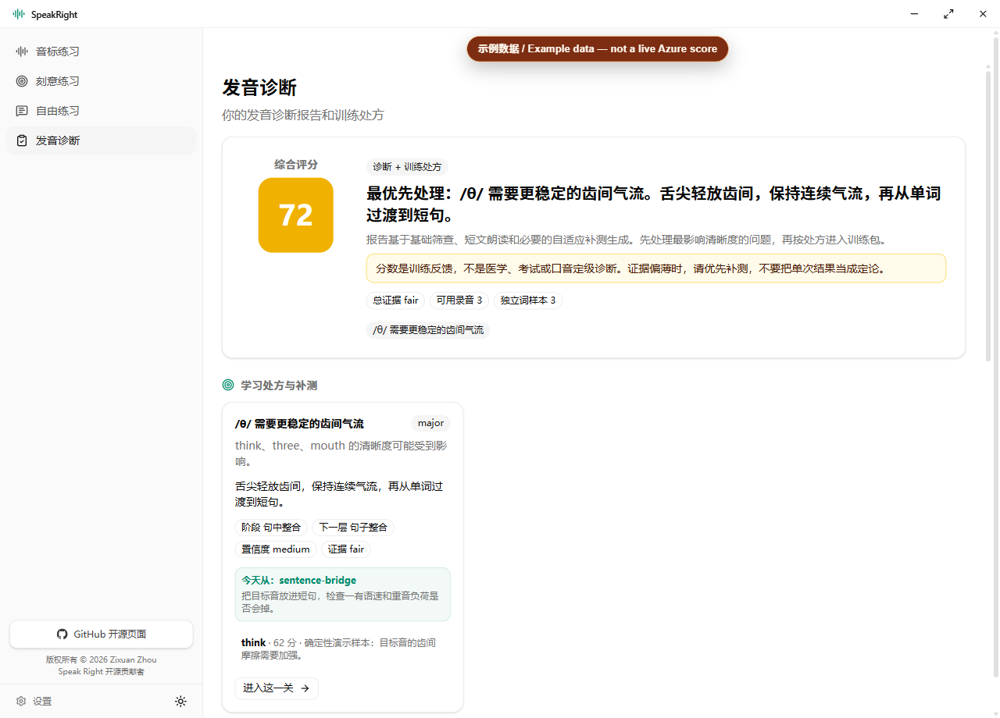
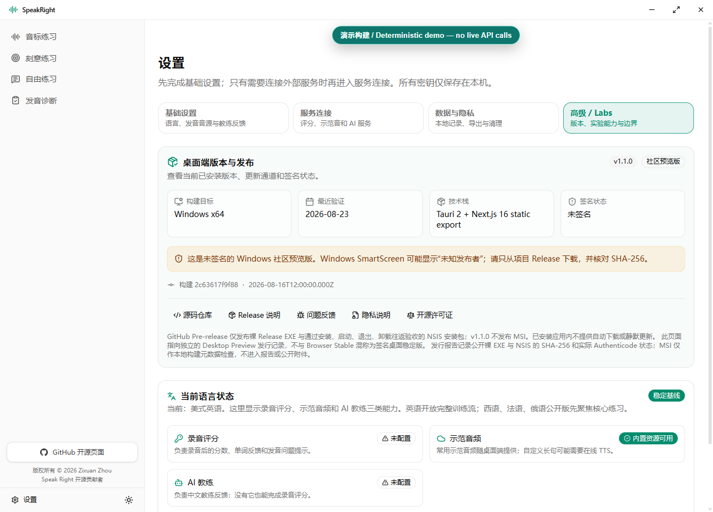

# SpeakRight

[English](README.md) · 简体中文

SpeakRight 是面向中文学习者的开源多语言发音练习项目。仓库包含两个明确分离的版本：Windows Desktop 使用 Tauri 打包；Browser Edition 在 Windows、macOS 和 Linux 的 Chrome/Edge 中从本地服务或静态导出运行。产品界面继续以简体中文为主，英文 README 只是 GitHub 的主入口，不会把中文 UI 英文化。

> **当前公开版本：SpeakRight v1.1.0。** [`v1.1.0` Browser Stable](https://github.com/zixuanzhou0-ai/speakright/releases/tag/v1.1.0)
> 和 [`v1.1.0-desktop-preview.1` 未签名 Desktop Preview](https://github.com/zixuanzhou0-ai/speakright/releases/tag/v1.1.0-desktop-preview.1)
> 已于 2026-08-24 从提交 `61c506af5c1f0b9b8397c74f69470c0da1e9f382`
> 公开发布，并通过匿名访问、资产与 SHA-256 核验。详见
> [发行核验记录](docs/validation/V1.1.0_RELEASE_VERIFICATION.md)。产品默认语言
> 继续保持中文。

[观看 90 秒内概览（实际 74 秒、无声、画面内含英文字幕）](docs/assets/demo/speakright-v1.1.0-overview.mp4)
· [英文 WebVTT 字幕](docs/assets/demo/speakright-v1.1.0-overview.en.vtt)
· [五分钟本地启动](#五分钟本地启动)

## 当前状态

| 版本 | 目录 | 适用人群 | 状态 |
| --- | --- | --- | --- |
| Windows Desktop | 仓库根目录 | 希望使用 Tauri 桌面应用与 Release EXE 流程的 Windows 用户 | 已公开 `v1.1.0-desktop-preview.1`；未签名社区预览版，必须提示 SmartScreen 风险；不是 Desktop Stable |
| Browser Edition | `apps/browser` | 希望在 Windows、macOS 或 Linux 浏览器中本地运行的用户 | 已公开 `v1.1.0` Browser Stable；BYOK，不是托管 SaaS |

英语 `en-US` 是稳定基线。西班牙语 `es-ES`、法语 `fr-FR` 和俄语 `ru-RU` 是实验模块；它们可进行音素/发音单位与自由练习，但不能描述为已具备正式 mastery 证据。

## 五分钟本地启动

需要 Node.js 22 和最新版 Chrome 或 Edge。全新克隆后，Browser Edition
是最短的评审路径，不需要注册 SpeakRight 托管账号：

Browser Edition：

```bat
cd /d <repository-root>
npm ci --prefix apps/browser
npm --prefix apps/browser run dev
```

打开 `http://localhost:3000`。静态版本可运行：

```bat
npm run build:browser
npm run serve:browser
```

Windows Desktop 开发：

```bat
cd /d <repository-root>
npm ci
npm run desktop:dev
```

Browser 下载、Windows 安装、源码构建、校验和与 Release EXE 验收边界见
[`INSTALLATION.md`](INSTALLATION.md) 和 [`docs/INSTALLATION.md`](docs/INSTALLATION.md)。
`v1.1.0-desktop-preview.1` 是有意保持未签名的社区预览版：公开二进制范围
仅限裸 Release EXE 与通过“安装、启动、退出、卸载”往返验收的 NSIS
安装包；MSI 只作为本地构建和元数据冒烟输入，没有进入公开 Release。发行
核验已确认 16 个 Desktop 资产、校验和、SBOM、验收报告和匿名下载；该版本
仍不得称为 Desktop Stable。
不应为了安装而绕过 SmartScreen、杀毒软件或企业安全策略。

## 仓库结构

| 路径 | 用途 |
| --- | --- |
| `apps/browser` | 跨平台 Browser Edition；不依赖 Tauri 或 Windows 安装器运行时 |
| 仓库根目录 / `src` / `src-tauri` | Windows Desktop 应用、Rust 命令与桌面发行门禁 |
| `docs/oss` | 开源与 Codex for Open Source 申请就绪证据 |
| `docs/validation` | 验收层级、声明—证据映射和真实用户测试发布门禁 |
| `docs/assets/screenshots/release/v1.1.0/browser` | v1.1.0 Browser 截图矩阵及清单 |
| `docs/assets/screenshots/release/v1.1.0/desktop` | v1.1.0 Desktop 截图矩阵及清单 |
| `docs/assets/demo` | 版本化概览视频、英文字幕、画面帧与媒体清单 |

## 核心功能与证据边界

- 语言专属发音单位、示范音频、录音、波形回放和逐项分析。
- 用户主动评分时，录音与目标文本发送到其配置的 Azure Speech Pronunciation Assessment。
- 数字分数来自 Azure 返回结果或自动化测试中明确标注的 fixture；LLM 只解释结构化证据，不负责创造或改写分数。
- 标准示范 TTS 可按版本和本机配置使用 ElevenLabs、Hermes/xAI 或 Vertex AI Gemini TTS；调用可能产生外部服务费用。
- API Key 由用户自行提供。Browser Edition 默认会话保存，只有用户明确开启时才持久保存到浏览器本地存储。
- 项目不是官方语言考试、医疗诊断、语音治疗或认证评分工具。

## 语言支持

| 语言 | 成熟度 | 当前开放范围 |
| --- | --- | --- |
| 美式英语 `en-US` | 稳定基线 | 完整音素练习、自由练习、进阶训练、诊断、学习证据与 AI 教练反馈 |
| 西班牙语 `es-ES` | 实验 | 发音单位、A/B 示例、自由练习与 `es-ES` Azure 评分 |
| 法语 `fr-FR` | 实验 | 发音单位、连诵/省音等教学材料、自由练习与 `fr-FR` Azure 评分 |
| 俄语 `ru-RU` | 实验 | 软硬辅音、重音/弱化等材料、自由练习与 `ru-RU` Azure 评分 |

实验语言的规则、韵律和复合发音单位属于教学与练习证据，不等于正式 mastery 或学习成效结论。

## v1.1.0 发行证据截图

以下画面来自隔离的 v1.1.0 证据构建。含分数的画面都会明确显示
**Example data — not a live Azure score**；real user scores come from Azure，
只有学习者主动发起评分并使用自己的配置时才会产生真实结果。

### Browser Edition（1280 × 800）

| 强化跟读 | 自由练习 |
| --- | --- |
|  |  |

| 诊断示例数据 | 设置与发行信息 |
| --- | --- |
|  |  |

完整 Browser 矩阵还覆盖 `390 × 844` 与 `360 × 800`，见
[Browser 证据清单](docs/assets/screenshots/release/v1.1.0/browser/manifest.json)。

### Windows Desktop（1280 × 920）

| 强化跟读 | 自由练习 |
| --- | --- |
|  |  |

| 诊断示例数据 | 设置与发行信息 |
| --- | --- |
|  |  |

完整 Desktop 矩阵还覆盖最低支持尺寸 `1024 × 800`，见
[Desktop 证据清单](docs/assets/screenshots/release/v1.1.0/desktop/manifest.json)。

## 验证

Browser Edition：

```bat
npm run lint:browser
npm run typecheck:browser
npm run test:browser
npm run build:browser
npm run browser:smoke:static
```

Windows Desktop：

```bat
npm run test
npm run typecheck
npm run lint
npm run build:desktop-frontend
npm run desktop:build
npm run desktop:preflight
npm run desktop:ui-smoke
```

自动化测试通过不等于真实用户采用或学习成效。证据分层和公开声明规则见 [`docs/validation/README.md`](docs/validation/README.md)。维护者确认已有 20 人在线下测试 SpeakRight；[`docs/validation/USER_TESTING_SUMMARY.md`](docs/validation/USER_TESTING_SUMMARY.md) 将其明确标注为未经独立审计的维护者声明，不索要参与者姓名、录音、联系方式或其他个人级证明，也不据此声称活跃用户数、完成率、满意度、留存率或学习效果。

## 隐私、安全与开源治理

- 数据流、本地存储、外部服务和删除边界：[`PRIVACY.md`](PRIVACY.md)
- 漏洞与凭据泄露私下报告：[`SECURITY.md`](SECURITY.md)
- 安装和使用支持：[`SUPPORT.md`](SUPPORT.md)
- 贡献指南：[`CONTRIBUTING.md`](CONTRIBUTING.md)
- 社区行为准则：[`CODE_OF_CONDUCT.md`](CODE_OF_CONDUCT.md)
- 维护者与决策边界：[`MAINTAINERS.md`](MAINTAINERS.md)
- 路线图与非承诺事项：[`ROADMAP.md`](ROADMAP.md)
- 公开 OSS/Codex readiness 证据：[`docs/oss/README.md`](docs/oss/README.md)
- v1.1.0 预发布候选证据与发布后核验：
  [`docs/validation/V1.1.0_RELEASE_CANDIDATE.md`](docs/validation/V1.1.0_RELEASE_CANDIDATE.md)
  与 [`docs/validation/V1.1.0_RELEASE_VERIFICATION.md`](docs/validation/V1.1.0_RELEASE_VERIFICATION.md)

不要把 API Key、Token、私人录音、学习数据导出、完整诊断包或含个人路径的日志发到公开 Issue/PR。外部服务如何保留和处理请求数据，以用户所选服务商的条款为准。

## 许可与免责声明

除非文件另有说明，源代码和源码文档按 MIT License 发布。第三方音频、视频、图像、声音、品牌和服务不会因为位于本仓库而自动获得 MIT 再许可；重新分发前请阅读 `LICENSE`、`NOTICE.md` 和 `THIRD_PARTY_NOTICES.md`。

GitHub 开源仓库：[github.com/zixuanzhou0-ai/speakright](https://github.com/zixuanzhou0-ai/speakright)
